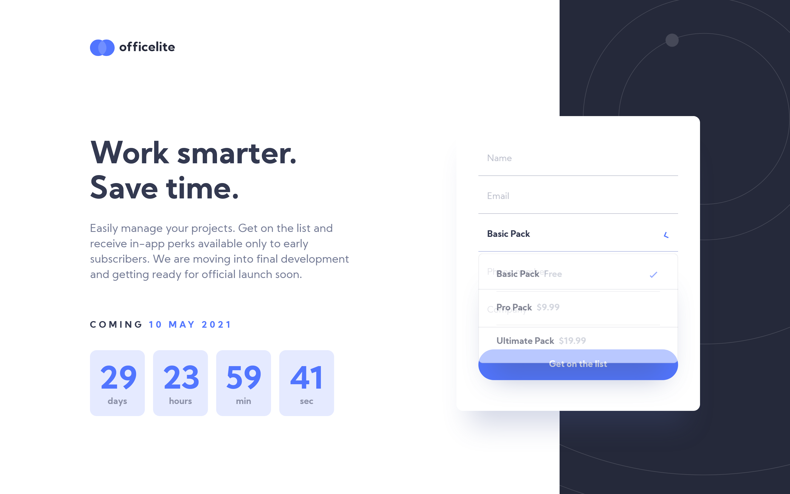

# Frontend Mentor - Officelite coming soon site solution

This is a solution to the [Officelite coming soon site challenge on Frontend Mentor](https://www.frontendmentor.io/challenges/officelite-coming-soon-site-M4DIPNz8g). Frontend Mentor challenges help you improve your coding skills by building realistic projects. 

## Table of contents

- [Overview](#overview)
  - [The challenge](#the-challenge)
  - [Screenshot](#screenshot)
  - [Links](#links)
- [My process](#my-process)
  - [Built with](#built-with)
  - [What I learned](#what-i-learned)
  - [Continued development](#continued-development)
  - [Useful resources](#useful-resources)
- [Author](#author)
- [Acknowledgments](#acknowledgments)

## Overview

### The challenge

Users should be able to:

- View the optimal layout for the site depending on their device's screen size
- See hover states for all interactive elements on the page
- See error states when the contact form is submitted if:
  - The `Name` and/or `Email Address` fields are empty
  - The `Email Address` is not formatted correctly
- **Bonus**: See a live countdown timer that ticks down every second
- **Bonus**: See a custom-styled `select` form control in the sign-up form

### Screenshot



### Links

- [View the solution on Frontend Mentor](https://www.frontendmentor.io/solutions/responsive-two-page-design-using-sass-bem-css-grid-vanilla-js-dom6Qq97_)
- [View the live site](https://officelite-coming-soon-theta.vercel.app/)

## My process

### Built with

- Semantic HTML5 markup
- SCSS custom properties
- Flexbox
- Mobile-first workflow
- Vanilla JavaScript
- Accessibility in mind!

### What I learned

- This challenge was the first one I did where I felt it was necessary to realy divide up my styles. There's definitely room for improvement but I think it is reasonably maintainable.

- It was also the first time I worked with JS Date object - to create the live countdown.

- However, out of the two bonus challenges, the custom select was definitely more challenging. Creating the select dropdown was quite straightforward, but ensuring that it is accessible was a lot more difficult. 
I aimed to recreate the native behaviour of the `<select>` element as closely as possible. Initially my requirements were:
  - the user should be able to open the option list by pressing `Enter`,
  - the user should be able to navigate the list using `arrow down` and `arrow up` keys,
  - the user should be able to select option by pressing `Enter`,
  - the user should be able to close the list when focused on the element by pressing `Enter` when focused on input or when an option is selected.

Eventually I decided that the box should open automatically when the input element gains focus and close when the input loses focus as well.

I used `role='combobox'` on the custom select container, as well as related aria roles and attributes following [W3C Recommendations](https://www.w3.org/TR/wai-aria-1.1/#combobox).

One of the issues I encountered is that on pressing `Enter` the form would validate (which is the native behaviour). To prevent this, I added an extra event listener to the `customSelect` input only - as this imitates the native form behaviour.

```js
customSelector.addEventListener('keydown', e => {
    if (e.key === 'Enter') {
        e.preventDefault();
    }
})
```

Another challenge was closing the dropdown when the focus moves to the next/previous input without making a selection. I used `focusout` event to achieve this. By adding a check for `!e.relatedTarget` to the condition, I could remove listening for a click outside of the custom select.

```js
customSelect.addEventListener('focusout', e => {
    if (!e.relatedTarget || (e.relatedTarget.tagName === 'INPUT' && e.relatedTarget !== csInput)) {
        closeDropdown();
        setState('initial');
    }
})
```

To improve accessibility further, I also added `autocomplete` attribute to other form inputs and custom focus styles throughout the page.

### Continued development

I loved the challege of creating the countdown and custom select element, and I want to continue learning about accessibility.

I would also like to improve the structure of my code - I've separated my script into three files to make it more readable but would like to learn how to do this better.

### Useful resources

The resources below really helped me understand how to make the custom select accessible:
- [WAI-ARIA 1.1 W3C Recommendation](https://www.w3.org/TR/wai-aria-1.1/#combobox)
- [Making a Better Custom Select Element by Julie Grundy](https://24ways.org/2019/making-a-better-custom-select-element/) 
- [Accessible custom select by Julie Grundy and Oliver Boermans](https://github.com/stringyland/custom-select)

## Author

- Frontend Mentor - [@AgataLiberska](https://www.frontendmentor.io/profile/AgataLiberska)
- Twitter - [@AgataLiberska](https://twitter.com/AgataLiberska)

